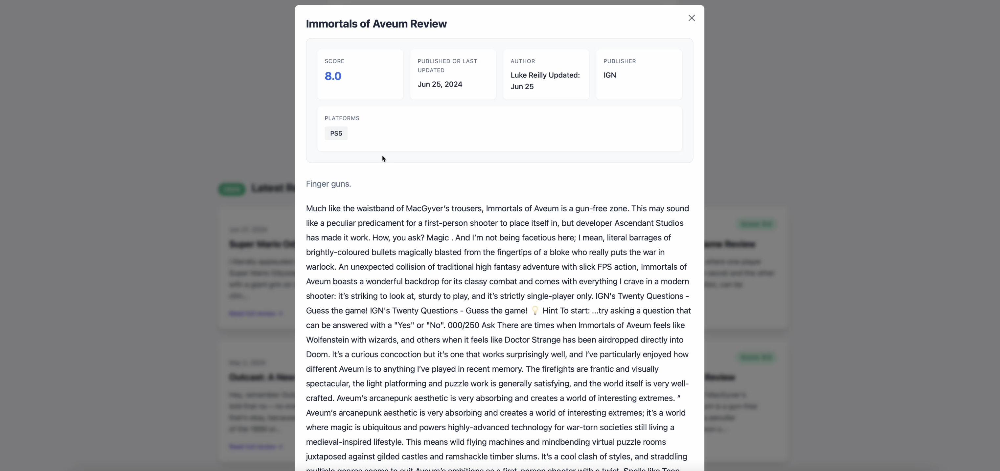

# Reviu - Game Review Explorer

Reviu is a professional video game review search system that allows users to explore and discover game reviews through an intuitive interface. The system features advanced search capabilities, including semantic search, category filtering, and automatic topic clustering of results.

## Features

- **Advanced Search Options**
  - Traditional keyword-based search with query boosting
  - Semantic search using sentence embeddings
  - Category-based filtering (Controls, Multiplayer, Story, Technical, Relaxing)
  - Minimum score filtering

- **Dynamic Result Clustering**
  - Automatic grouping of search results into relevant topics
  - Interactive cluster exploration
  - Detailed review viewing with similar game recommendations

- **Latest Reviews**
  - Showcase of recent game reviews
  - Random selection for variety

## Technology Stack

- **Backend**
  - Flask (Python web framework)
  - Apache Solr (Search engine)
  - sentence-transformers (Semantic search capabilities)
  - scikit-learn (Results clustering)

- **Frontend**
  - HTML5/CSS3
  - Tailwind CSS
  - JavaScript (Vanilla)

## Installation & Setup

1. **Prerequisites**
   ```bash
   # Install Docker and Docker Compose
   # Install Python 3.8+
   ```

2. **Clone the Repository**
   ```bash
   git clone [repository-url]
   cd reviu
   ```

3. **Environment Setup**
   ```bash
   python -m venv venv
   source venv/bin/activate  # On Windows: .\venv\Scripts\activate
   pip install -r requirements.txt
   ```

4. **Start Solr**
   ```bash
   make up
   make setup-cores
   make setup-semantic
   ```

5. **Index Data**
   ```bash
   make index-data
   make process-semantic
   ```

6. **Run the Application**
   ```bash
   python app.py
   ```

The application will be available at `http://localhost:5000`

## Query Examples

The system supports various pre-defined queries for different gaming aspects:

```json
// Controls & Gameplay Query
{
  "params": {
    "q": "Content:(controls good tight precise responsive fluid excellent smooth)",
    "rows": 30,
    "fl": "id,Title,Score,Subtitle,Content",
    "sort": "score desc"
  }
}

// Multiplayer Experience Query
{
  "params": {
    "q": "Content:(multiplayer online coop cooperative competitive pvp gameplay fun engaging players teams)",
    "rows": 30,
    "fl": "id,Title,Score,Subtitle,Content",
    "sort": "score desc"
  }
}
```

## Interface Screenshots


*Main search interface with category filters and search options*


*Example of clustered search results*


*Detailed review view*


## Development

- **Adding New Queries**
  - Place query JSON files in the `queries` directory
  - Follow the existing query format
  - Update the Makefile with new query targets

- **Modifying Search Behavior**
  - Edit `construct_solr_query()` in `app.py`
  - Update Solr schema configurations in `docker/solr/conf/`

- **Customizing Result Clustering**
  - Modify the `cluster_results()` function in `app.py`
  - Adjust category keywords and scoring logic

## Acknowledgments

- IGN for the game reviews dataset